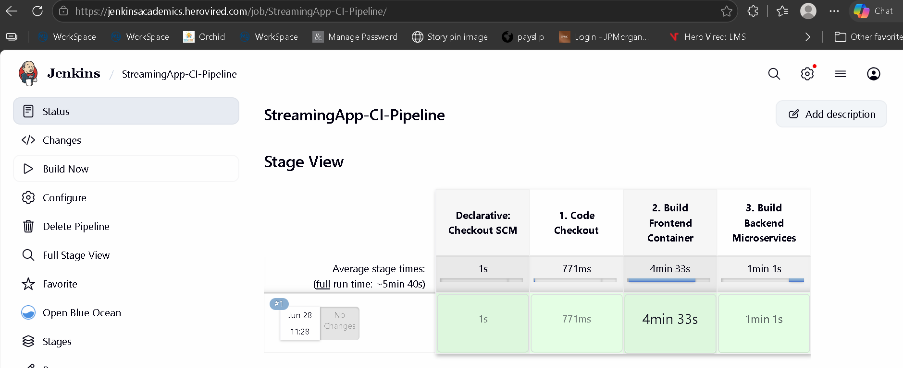
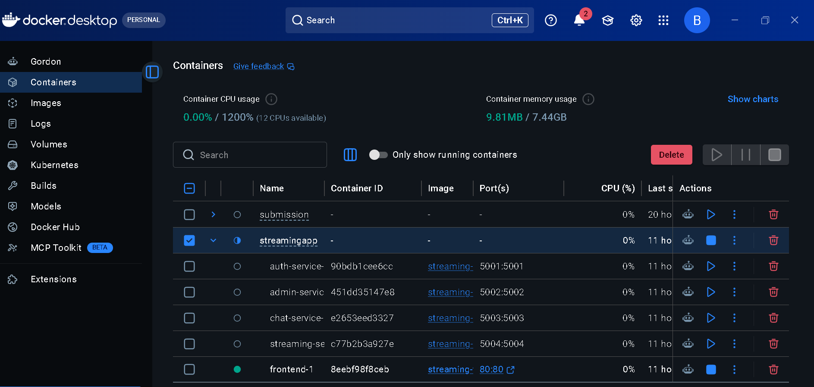
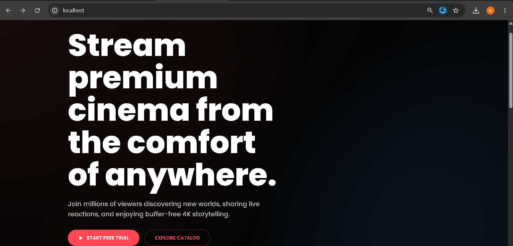

# 🎬 Microservices Streaming App: Containerization & Orchestration

A production-ready, highly scalable MERN application refactored from a monolithic codebase into decoupled microservices. This ecosystem features optimized container runtimes, unified local orchestration configurations, validation-checked Kubernetes deployment blueprints, and a completely automated Continuous Integration (CI) pipeline.

---

## 🏛️ System Architecture Layout

The platform splits structural responsibilities across five isolated application layers communicating over a virtualized bridge network.

```text
                  +-----------------------------------+

                  |        frontend-service           |
                  |     (React / Nginx Engine)        |
                  |            Port 80                |
                  +---------------+-------------------+
                                  |
         +------------------------+------------------------+

         |                        |                        |
+--------v-------+       +--------v-------+       +--------v-------+

|  authService   |       |  adminService  |       |  chatService   |
|  Node API      |       |  Node API      |       |  Node API      |
|  Port 5001     |       |  Port 5002     |       |  Port 5003     |
+----------------+       +----------------+       +----------------+
                                  |
                         +--------v-------+

                         | streamingService|
                         |  Node API      |
                         |  Port 5004     |
                         +----------------+
```

### Core Service Definitions
* **`frontend` (Port 80)**: High-performance user interface layer using a multi-stage Docker design. React assets are compiled in a Node environment and then dynamically served via Nginx.
* **`authService` (Port 5001)**: Manages secure user registration, token generations, and login credential verifications.
* **`adminService` (Port 5002)**: Handles system diagnostics, content uploading metrics, and user management controls.
* **`chatService` (Port 5003)**: Manages live messaging traffic, room tracking, and real-time community stream interactions.
* **`streamingService` (Port 5004)**: Coordinates high-throughput video asset playback, media buffering, and video chunks.

---

## ⚙️ Engineering & Build Strategies

### 1. Multi-Stage Container Optimization
To minimize operational image sizes and prevent unwanted security exposure, all services deploy lightweight architectures:
* **Base Runtimes**: Utilizing `node:22-alpine` keeps individual service profiles limited to ~300MB.
* **Production Trimming**: Enforcing `--omit=dev` parameters flags only business-critical dependencies while omitting developer overhead files.

### 2. Local Multitasking Orchestration (`docker-compose`)
Local multi-container instances are dynamically bound via an active isolated network grid, allowing the stack to cleanly load simultaneously with a single execution step:
```bash
docker compose up -d
```

### 3. Kubernetes Infrastructure (Helm Packages)
Declarative orchestration specifications are structured into reusable application package objects within the `/helm-chart` tree:
* **Scaling Boundaries**: Configured to instantiate dual application replicas (`replicas: 2`) across cloud availability zones.
* **Networking Layout**: Proxies frontend workloads out over cloud `LoadBalancer` endpoints, while isolating core application microservices cleanly behind protected cluster internal pathways (`ClusterIP`).

---

## 🤖 Continuous Integration Pipeline State

Automation configurations run dynamically via a repository root script (`Jenkinsfile`). The pipeline maps out automated compilation checks across active project branches.

### 📊 Performance Metrics Graph
```text
+-------------------------+------------------+-----------------------+--------------------------+

| Declarative Checkout    | 1. Code Checkout | 2. Build Frontend     | 3. Build Backend         |
+-------------------------+------------------+-----------------------+--------------------------+

|          1s             |      771ms       |      4min 33s         |         1min 1s          |
|        (GREEN)          |     (GREEN)      |       (GREEN)         |         (GREEN)          |
+-------------------------+------------------+-----------------------+--------------------------+
```
* **Build Outcome**: **SUCCESS** (Pipeline Run #1 Completed Flawlessly)
* **Target Cloud Deployment Workspace**: Mumbai Subnet Registry (`ap-south-1`)

---

## 🔍 Local Verification Diagnostics

Active service states running locally confirm complete stability across the network fabric:

```text
NAME                               STATUS          PORTS
streamingapp-frontend-1            Up 13 seconds   0.0.0.0:80->80/tcp
streamingapp-auth-service-1        Up 13 seconds   0.0.0.0:5001->5001/tcp
streamingapp-admin-service-1       Up 13 seconds   0.0.0.0:5002->5002/tcp
streamingapp-chat-service-1        Up 13 seconds   0.0.0.0:5003->5003/tcp
streamingapp-streaming-service-1   Up 13 seconds   0.0.0.0:5004->5004/tcp
```

---

## 📸 Deployment & Automation Verification Artifacts

### 1. Continuous Integration (Jenkins Pipeline)
This snapshot verifies that the automated build engine successfully compiles the frontend and backend microservices upon code ingestion.



### 2. Local Container Orchestration (Docker Desktop Stack)
This snapshot verifies that all 5 decoupled application layers successfully launch simultaneously, map port spaces, and remain active without crashing.



### 3. Functional Application Interface (Localhost Runtime)
This snapshot verifies that the multi-stage static asset engine renders the user interface framework perfectly in the browser.


